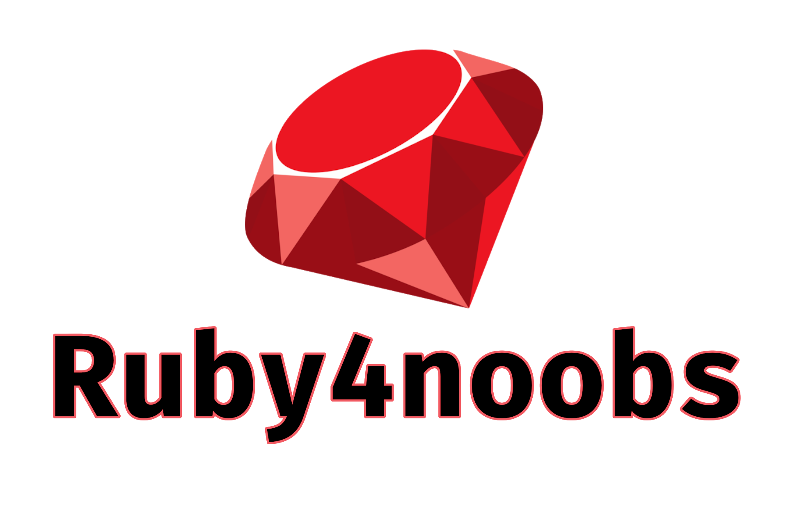

# Ruby4Noobs

Este repositório é um tutorial dedicado ao ensino da Linguagem de programação Ruby, que  originou um dos Frameworks Web mais conhecidos, o Ruby on Rails!

## Roadmap

### Pré Requisitos

1. [Instalação do Ruby no Windows](contents/instalacao-windows/README.md)
2. [Instalação do Ruby no Linux](contents/instalacao-linux/README.md)
3. [Como executar um script Ruby](contents/usar-ruby/README.md)

### Conteúdos

1. [Hello World](contents/hello-world/README.md)
2. [Variáveis e tipos primitivos](contents/variaveis/README.md)
3. [Comentários em Ruby](contents/comentarios/README.md)
4. [Operadores](contents/operadores/README.md)
5. [Estruturas Condicionais](contents/condicionais/README.md)
6. [Input do Usuário](contents/input-usuario/README.md)
7. [Estruturas de Repetição](contents/repeticoes/README.md)
8. [Arrays](contents/arrays/README.md)
9. [Funções](contents/funcoes/README.md)
10. [Lendo e escrevendo arquivos](contents/ler-escrever/README.md)
11. [Ruby Gems](contents/gems/README.md)
12. [O que é o Rails?](contents/rails/README.md)

Para contribuir, veja o arquivo CONTRIBUTING.md, pois lá estão as instruções, bons estudos.
